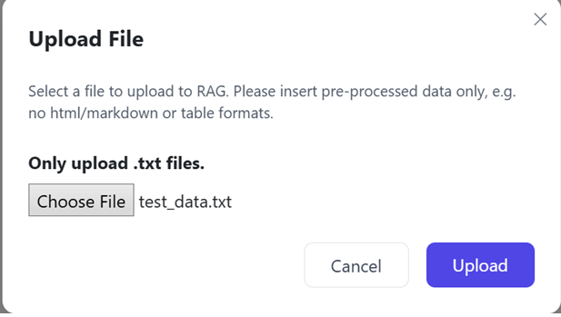
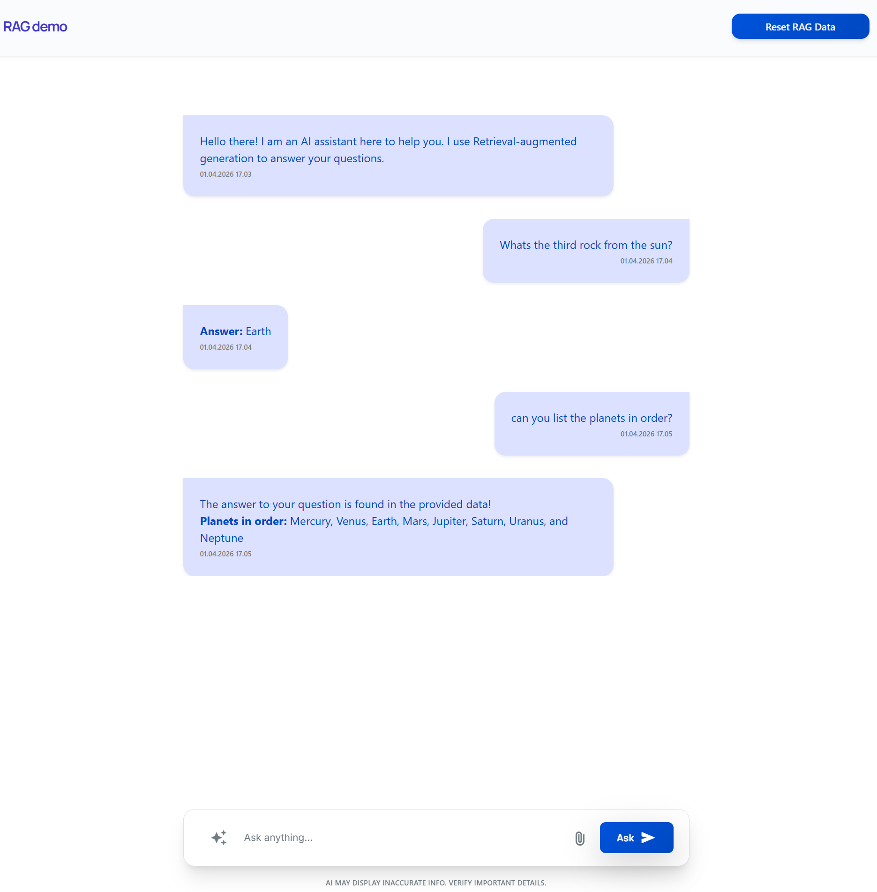

# Project

This small project is a full-stack web application that demonstrates a Retrieval-Augmented Generation (RAG) pipeline using local LLM models via Ollama.  

Users can create a local account, log in, and upload text documents that are scoped to their user profile, and query their content using natural language.  
The system processes documents by splitting them into chunks, generating embeddings, and storing them for efficient semantic retrieval.

When a user asks a question, the application retrieves the most relevant document chunks using cosine similarity and provides them as context to a local LLM (Llama), which generates the final answer.  
Developed using Visual Studio 2026.

---

## Setup
How to setup SQLite after cloning the repo:

1. in powershell type in these commands:
2. Add-Migration InitialCreate
3. Update-Database

Setup Ollama:

1. Download Ollama https://ollama.com and install it
2. in cmd-prompt you can then "ollama pull embeddinggemma" and "ollama pull llama3" to download the required LLMs
3. You should also disable cloud models, auto-download uploads, and "Expose Ollama to the network" settings.
4. You can change context length as you wish, for me 4k was enough for my small tests.

And you should be ready to go!

---

### Tech Stack

- **Backend:** .NET Core MVC  
- **Frontend:** Vue.js (Options API)  
- **AI Models:** Ollama ->  `embeddinggemma` (latest), `llama` (latest)  
- **Caching:** In-memory caching
- **SQLite:** Simple and light-weight database
- **TailWind:** For CSS
- **Google Stitch:** Used for basic UI layout

---

#### Features
- Simple local authentication (account creation without email verification or password reset)
- User-specific RAG functionality
- AI-powered embeddings & responses using Ollama models
- Semantic search
- Simple caching system for improving response times  
- MVC pattern for clean separation of concerns  
- Vue Options API for reactive and maintainable frontend components  
- Simple UI

---

  
*User uploads a document to be used for context*

  
*LLM answers natural language questions based on /Docs/test_data.txt*

---

##### Notes
- /Docs/test_data.txt for quick testing.
- This is a small learning project focused on understanding LLM + RAG concepts, rather than building a production-ready system.
- Ollama service will run on your pc startup automatically unless you configure otherwise.
- I used SQLite instead of an actual vector database and embeddings are stored as JSON strings to keep it simple, naturally for production this would not suffice.
- Used local LLMs for gaining some more experience, and they were free, flexible and enough for my purposes with this project.
- The authentication flow is intentionally minimal and designed for demonstration purposes only:
	- No email verification
	- No password reset functionality
	- User accounts are stored locally
	- Focus is on isolating user-specific document data for the RAG pipeline